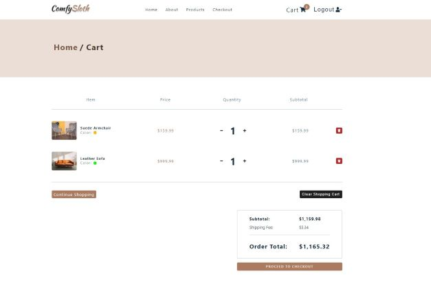

# React - Furniture Store

[This project](https://gurhan-react-furniture-store.netlify.app) is a furniture ecommerce website. The furniture data is recieved from API, user can log in and out using google or social accounts (using Auth0). Once user logs in, user can checkout the card with test stripe payment.

## Table of contents

- [React - Furniture Store](#react---furniture-store)
  - [Table of contents](#table-of-contents)
  - [Overview](#overview)
    - [The challenge](#the-challenge)
    - [Screenshots](#screenshots)
    - [Links](#links)
  - [My process](#my-process)
    - [Built with](#built-with)

## Overview

### The challenge

Users should be able to:

-   Get the list of products from API call
-   Filter and sort the products by using buttons
-   Add products to cart, toggle the amount of the items in the cart, and remove from the cart
-   Checkout using credit card
-   Log in with Google accout and social accounts.

### Screenshots

 
 
 
 

### Links

-   Solution URL: [Live Website](https://gurhan-react-furniture-store.netlify.app)

## My process

### Built with

-   React
-   Functional Components
-   CSS
-   Styled Components
-   React Hooks
-   API
-   Auth0() Authentication
-   Stripe
-   Netlify Serverless Functions
